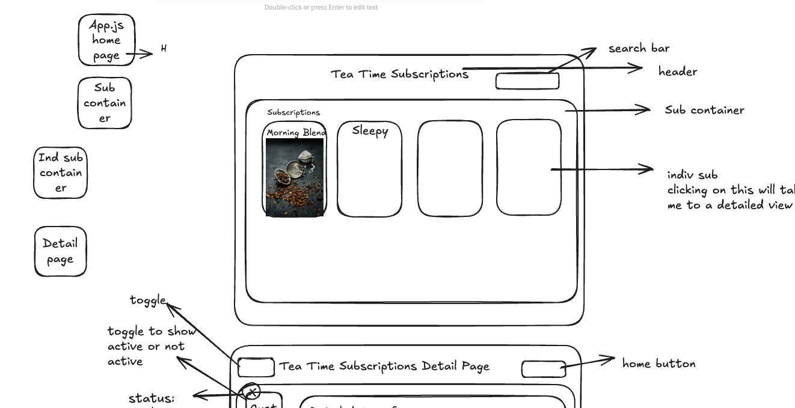
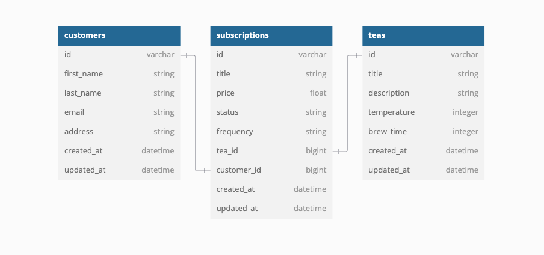
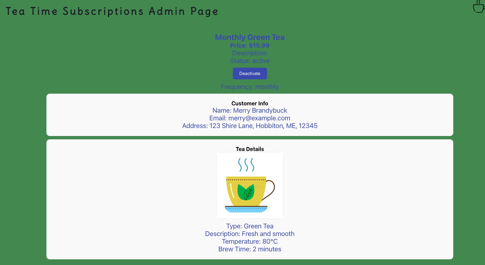

<h1 align="center"> Tea Time Subscription FullStack </h1>

**Planning**

**HomeScreen**

**Details Page**

<h2 align="center"> Context </h2>

"Tea Time Subscription" is a final mod 3 Full stack project were I built a backend and a frontend in two days. This is an admin page where I can see what customers have tea subscriptions and toggle on and off their subscriptions.

<h2 align="center"> Tech </h2>

BE 
- Ruby on Rails, tested with RSpec, simplecov

FE 
- Built with React 

<h2 align="center"> Installation </h2>

1. Fork and clone this BE repo 
2. `cd` into the repo
2. Run these commands in your terminal
  - `bundle install`
  -  `rails db:{drop, create, migrate, seed}`
  -  `rails s`

4. Fork this FE repo
5. `cd` into cloned repo
6. Run `npm install`
7. Run `npm start`
8.  Enter `control + c` in your terminal to stop running the React app at any time
9. To run Cypress tests, use `npx cypress open`

<!-- This is where we will display the GIF (no more than 2 of functionality) -->

<h2 align="center"> Contributors </h2>

Candice Cirbo - [linkedin](https://www.linkedin.com/in/candicecirbo/) - [gitHub](https://github.com/CCirbo) - ccirbots@gmail.com

<h2 align="center"> Learning Goals </h2>

Things we'll be looking for:
- A strong understanding of Rails, React and best practices
- BE: Ability to create restful routes
- BE: Demonstration of well-organized code, following OOP
- BE: Test Driven Development
- FE: An understanding of basic usability practices and standards
- FE: A clear hierarchy of information
- Clear documentation
- Your ability to prioritize for MVP
- Clean, well factored code
Try to limit your total time to approximately 7-8 hours each side of the stack. We recommend starting with the BE, and then moving onto the FE, but you are welcome to design your own workflow. Prioritize what is important to completing MVP and demonstrating your capabilities as a developer.

Tea Subscription Service
You will create a full stack application for a Tea Subscription Service, including a Rails API and a React front end.

Rails API
Requirements:
At a minimum, you must create:

An endpoint to get all tea subscriptions
An endpoint to get info about one subscription, including the tea(s) involved and what customer(s) is subscribed or has been in the past (if cancelled)
An endpoint to cancel a specific subscription
Beyond the base requirements, include any additional endpoints you'd like, but be mindful of your time. You don't need to go overboard, consider what might be necessary to achieve MVP so that this API is easy to understand and consume by a Frontend Developer.

If you are looking for a stretch option, you can consume this API for tea product information: Spoontacular API

Data Details
Note: The below data outlines are meant to be a guide for data details you may use in the application. If you want to change or include more information please do so. The data below does not need to be a direct mapping to your database schema (i.e. there might be more tables involved). Keep in mind there are many ways to implement this at a database level. Just be sure to choose an option that makes sense to you and reflects how you are assuming the tea subscription service functioning. You can make business assumptions. Using fake data in your application is okay.

**Tea**

- Title
- Description
- Temperature
- Brew Time

**Customer**

- First Name
- Last Name
- Email
- Address

**Subscription**

- Title
- Price
- Status
- Frequency

Front End

Again, try to limit your total time on the FE to around 8 hours. Prioritize what is important to get this working and as close to MVP as possible. Please do not attempt to recreate an entire existing Tea Shop's website. We're interested in seeing your ability to write clean code to solve a problem with an understanding of basic UX. We're not looking for fancy UI tricks or hacks.

Tea Subscription React App
You will create a tea subscription application that consumes the Rails API you've just built.

Requirements:
At a minimum, you must show:

List of subscriptions (name with an image or icon)
Detailed View of subscription (name, image or icon, description, tea(s) and customer(s) involved)
The ability to cancel a subscription (for one tea at a time or multiple teas) somewhere in the application
Some sort of search, filter, OR sort
Beyond the base requirements, include any additional elements you'd like, just be mindful of your time. You don't need to go overboard, just consider what might be necessary to achieve MVP so that this app is easy-to-use, information is clear, and navigation is painless. Put yourself in a user's shoes and think about what you would need (or want). The app should be usable on desktop, tablet, and mobile devices.

- **Technical Skills**:
  - Implement and deploy both backend (Rails API) and frontend (ReactJS) applications.
  - Build our own API.
  - Ensure thorough testing, including unit and integration tests.
  - Adhere to MVC architecture 

- **Frontend Development**:
  - Build a multi-page application with React Router.
  - Implement error-handling.
  - Ensure responsive design across different screen sizes.

- **Backend Development**:
	- Database Design: Design and implement relational databases (e.g., PostgreSQL) and optimize queries.
	-	API Development: Create RESTful APIs with Rails 
	- Testing: Write unit tests with RSpec and check coverage with simplecov.

